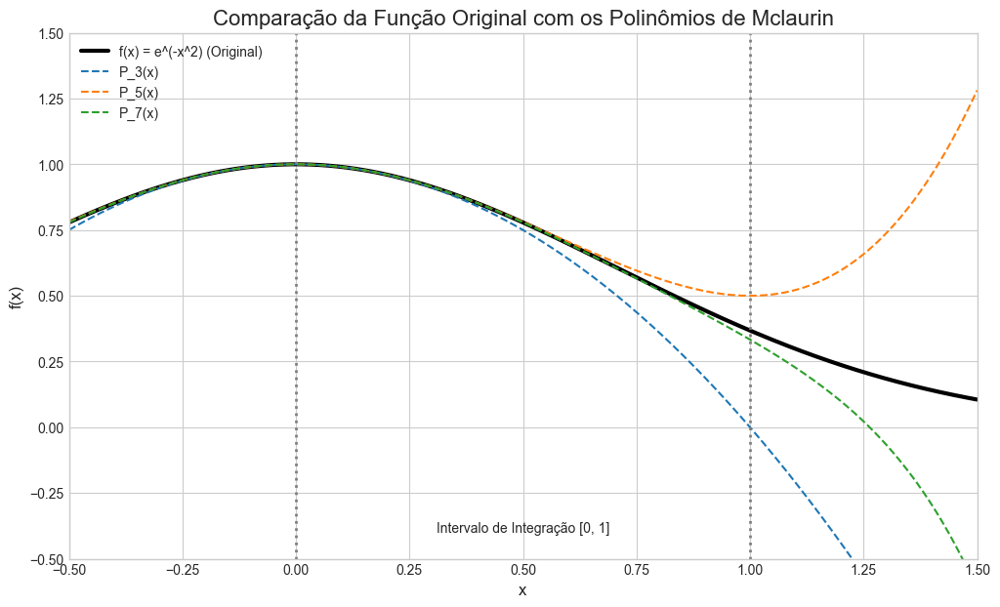
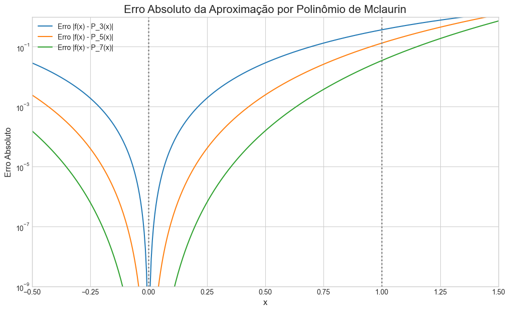

# Aproximação de Integrais Não Elementares por Séries de Potências

### Trabalho da Disciplina de Cálculo I

Este repositório contém a implementação de um método para aproximar integrais não elementares utilizando Séries de Taylor (especificamente, a Série de Maclaurin). O projeto foi desenvolvido como parte da avaliação da disciplina de Cálculo I.

---

## 📜 Sumário

- [Visão Geral do Projeto](#-visão-geral-do-projeto)
- [Conceitos-Chave](#-conceitos-chave)
- [Estrutura do Repositório](#-estrutura-do-repositório)
- [Tecnologias Utilizadas](#-tecnologias-utilizadas)
- [Como Executar o Projeto](#-como-executar-o-projeto)
  - [Pré-requisitos](#pré-requisitos)
  - [Instalação](#instalação)
  - [Execução](#execução)
- [Resultados e Análise](#-resultados-e-análise)
  - [Tabela de Resultados](#tabela-de-resultados)
  - [Análise Gráfica](#análise-gráfica)
- [Autor](#Israel Magalhães do Carmo)

---

## 🔭 Visão Geral do Projeto

Muitas funções importantes em ciência e engenharia, como a função de erro `erf(x)` (baseada em `e^(-x²)`), não possuem uma primitiva que possa ser expressa em termos de funções elementares (polinômios, funções trigonométricas, exponenciais, etc.). Suas integrais são, portanto, "não elementares".

Este projeto demonstra como superar essa limitação aproximando o integrando por um polinômio de Maclaurin. Uma vez que a função é representada por um polinômio, a integral pode ser facilmente calculada termo a termo.

O trabalho foca na função **`f(x) = e^(-x^2)`** e calcula a integral definida no intervalo **`[0, 1]`**, analisando a precisão da aproximação para diferentes ordens do polinômio.

---

## 🔑 Conceitos-Chave

- **Integrais Não Elementares:** Integrais de funções contínuas cujas primitivas não podem ser expressas em termos de funções elementares.
- **Série de Taylor/Maclaurin:** Uma representação de uma função como uma soma infinita de termos, calculados a partir dos valores das derivadas da função em um único ponto. A Série de Maclaurin é um caso especial da Série de Taylor, centrada em `a=0`.
- **Aproximação Polinomial:** Utilização de um polinômio finito para aproximar o comportamento de uma função mais complexa em um determinado intervalo.

---

## 📁 Estrutura do Repositório
.
├── 📓 trabalho_calculo.ipynb
|
├── 🖼️ imagens/
|   |
│   ├── grafico_comparacao.png
|   |
│   ├── grafico_erro.png
|   |
│   └── grafico_integral.png
|
├── ⚙️ requirements.txt
|
├── 📄 README.md
|
├── 📜 LICENSE
---

## 🛠️ Tecnologias Utilizadas

- **Python 3.x**
- **Jupyter Notebook**
- **NumPy:** Para cálculos numéricos eficientes.
- **SciPy:** Para o cálculo do valor de referência da integral (`scipy.integrate.quad`).
- **Pandas:** Para a criação e exibição de tabelas de dados.
- **Matplotlib:** Para a geração dos gráficos de análise.

---

## 🚀 Como Executar o Projeto

Siga os passos abaixo para executar o notebook em seu ambiente local.

### Pré-requisitos

- Python 3.x instalado.
- Git instalado (para clonar o repositório).

### Instalação

1.  **Clone o repositório:**
    ```bash
    git clone https://github.com/seu-usuario/seu-repositorio.git
    cd seu-repositorio
    ```

2.  **Crie um ambiente virtual (recomendado):**
    ```bash
    python -m venv venv
    ```

3.  **Ative o ambiente virtual:**
    - No Windows:
      ```bash
      .\venv\Scripts\activate
      ```
    - No macOS/Linux:
      ```bash
      source venv/bin/activate
      ```

4.  **Instale as dependências:**
    O arquivo `requirements.txt` contém todas as bibliotecas necessárias.
    ```bash
    pip install -r requirements.txt
    ```

### Execução

1.  **Inicie o Jupyter Notebook:**
    ```bash
    jupyter notebook
    ```
2.  No seu navegador, abra o arquivo `trabalho_calculo.ipynb`.
3.  Execute as células do notebook sequencialmente. Você pode fazer isso clicando em `Cell > Run All` no menu superior.

---

## 📊 Resultados e Análise

### Tabela de Resultados

A tabela abaixo compara a integral aproximada com o valor de referência (calculado com `SciPy`) para diferentes ordens do polinômio de Maclaurin.

| Ordem (n) | Integral Aproximada | Valor de Referência (SciPy) | Erro Absoluto |
| :-------: | :------------------ | :-------------------------- | :------------ |
|     3     |    0.6666666667     |        0.7468241328         |  0.0801574661 |
|     5     |    0.7666666667     |        0.7468241328         |  0.0198425339 |
|     7     |    0.7428571429     |        0.7468241328         |  0.0039669899 |

### Análise Gráfica

Os gráficos gerados pelo notebook ajudam a visualizar a qualidade da aproximação.

**1. Comparação da Função com os Polinômios**

*O gráfico mostra que, à medida que a ordem do polinômio aumenta, a aproximação se torna mais precisa no intervalo de integração.*

**2. Erro Absoluto da Aproximação**

*O erro é mínimo próximo do ponto de expansão (x=0) e aumenta à medida que nos afastamos. A escala logarítmica evidencia a drástica redução do erro com o aumento da ordem.*

**3. Visualização da Integral como Área**

*Este gráfico compara a área sob a curva da função original com a área sob a curva do polinômio de ordem 7, validando visualmente a precisão do método de aproximação.*

---

## 👤 Autor

- **Nome:** Israel Magalhães do Carmo
- **Curso:** Bacharelado em Sistemas de Informação
- **Professor(a):** Graziela Barboza Guaitolini

---

## 📄 Licença

Este projeto está sob a licença MIT. Veja o arquivo `LICENSE` para mais detalhes.